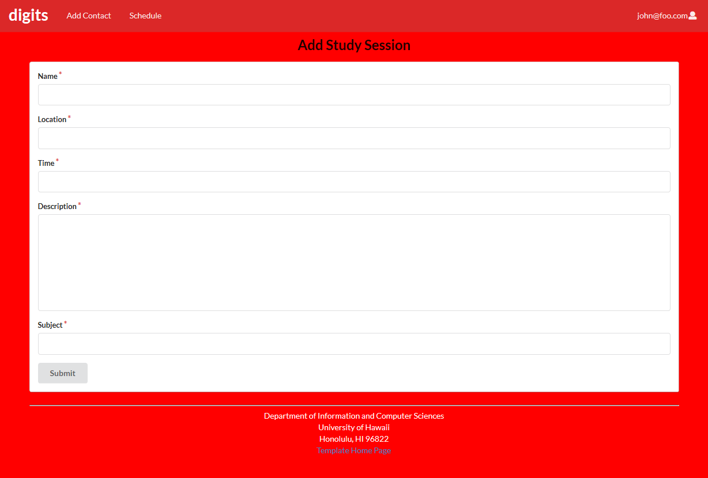
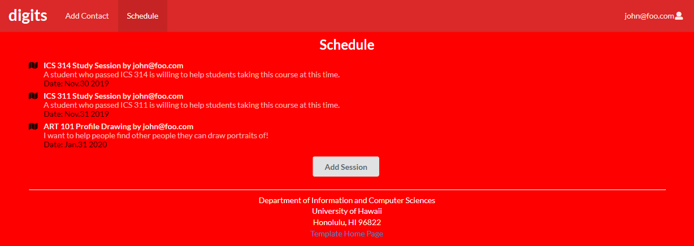

## Overview 

Studymatchs is a website with the goal to create study groups at University of Hawaii at Manoa

* This will assign people with similar classes to each other, to establish as studying network.
* Students in similar classes would be able to scedule study sessions with each other at any future time and date.
* Students that have already finished a class can volunteer to assist in study sessions.
* Study sessions can be sceduled at certain locations such as Sinclair Library and Hamilton Library.

## Milestone 1

For the first milestone, our goal wast to create the basic pages and components needed to operate the site.

  
  
