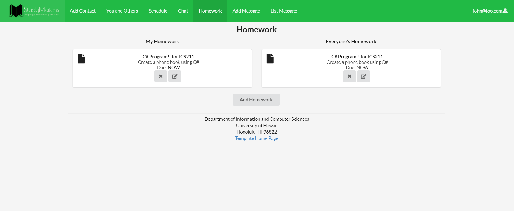

# [StudyMatchs UH Manoa](https://github.com/studymatchs)

## Overview 

[Studymatchs](http://studymatchs.meteorapp.com) is a website with the goal to create study groups at University of Hawaii at Manoa

* This will assign people with similar classes to each other, to establish as studying network.
* Students in similar classes would be able to scedule study sessions with each other at any future time and date.
* Students that have already finished a class can volunteer to assist in study sessions.
* Study sessions can be sceduled at certain locations such as Sinclair Library and Hamilton Library.

## User Guide
The first page you will see is the landing page. From here, you will be able to sign up or sign in to the page.

After signing in/signing up, you will be able to access the other tabs, which allow you to do other things.

Note: When the user signs up for an account, they only have to make a username and a password for their account. Profile details can be added or modified later.

When the user logs in, the Landing page is replaced by the User Landing page. The User Landing page has three functions: List classmates in the user’s class, list the homework the user created, and list any study sessions created by any users. While some features are accessible in the User Landing page, there are also dedicated pages for the homework and the study session components.

Under the Homework section, the user can create homework assignments. To create a homework assignment, the user can click the “Add Homework” button and fill out the appropriate information. Other users can and will be able to see these assignments so they can be referenced when making a study session. Assignments listed here can be edited or deleted by the user who created them, but other users can indicate that they can help with the assignment by clicking the handshake button where the edit and delete buttons were.

A similar system is in the Schedule page. The user creates an event via the “Add Session” button. After filling out the appropriate information, the user’s study session is displayed as a card, which can be modified or deleted by the creator or an admin while other users can click the “I’m going!” button to attend as well. Users can also edit and delete their posts.

There is also a chat page for the sake of quick communication with other users. For faster answers or general communication, it’s recommended to use the chat page. For answers that need to go a little more in-depth, there is a message board for that.

The message board is straightforward. To create a topic, the user can click the “Add Message” button on the toolbar. From there, the user can fill out the appropriate information on the page. After clicking ‘Submit”, their message can be seen on the List Messages page.

The List Messages page has several buttons on the page. Each button pertains to a certain topic. When the user clicks on them, the topic, question, and the various answers are available on the screen.

If a user wants to view their profile, they can simply click on their username in the upper right hand corner. The dropdown menu will, along with the option to log out, display the user’s profile including their name, description, GPA, and more.

To edit it, they can click on the edit icon. A form will appear with the information to edit.

To view and change the classes they are in, the user can click on the Show Classes button beneath their profile. A screen will then appear listing the classes that the user is enrolled in.

To drop a class, the user can simply click on the class in the screen to remove themselves from the class.  If they want to add a class, they can type in the class they are in, then hit “Submit”.

## Developer Guide
First, make sure you install Meteor using [this site.](https://www.meteor.com/install)

Then, clone the repo onto your account by visiting our site clicking the 'Use this template' button on the right. Then download the repo onto your Github Desktop. Alternatively, you can also download the zipped directory. If you haven't downloaded it, you can [here.](https://github.com/studymatchs/StudyMatchs)

After downloading the repo, cd into the studymatchs/app directory in your terminal. 

Install the npm dependencies by entering the following commands: 
  meteor npm install
You can test to see if your meteor application has been installed correctly by running:
  meteor npm run start
and visiting the site at [https://localhost:3000/](https://localhost:3000)

## [Milestone 1](https://github.com/studymatchs/StudyMatchs/projects/2)

For the first milestone, our goal was to create the basic pages and components needed to operate the site. To start, we used the Digits program as a template for the program due to having much of the needed components. From there, Rex edited the landing page and the project's theme to suit the goal.

[Landing page](http://studymatchs.meteorapp.com/#/)

A user landing page, from now on knownas the welcome page, is set up to include information for the user, like their classmates, their classes, and a list of upcoming events.

[Welcome page](http://studymatchs.meteorapp.com/#/welcome)
  
Jui-chen worked on a page to add classmates that are in the user's class. It currently uses the Contacts system in the Digits application, but further functionality would be added later on.

[Add Classmate page](http://studymatchs.meteorapp.com/#/add)

He also modified the List Contacts page to display classmates. At the moment, it still relies on much of the Contacts framework in Digits.

[List Classmates/Classes page](http://studymatchs.meteorapp.com/#/list)

James worked on the message system. The goal of a message system is to allow the users to engage in a message board to get help, even if they cannot meet in person for a study group.

[Message page](http://studymatchs.meteorapp.com/#/AddMessage)

The schedule page was created by Keanu. The main purpose of this site is to be able to create study sessions with other students at a specified time and location.
  

[Schedule page](http://studymatchs.meteorapp.com/#/schedule)

## [Milestone 2](https://github.com/studymatchs/StudyMatchs/projects/3)

In the second milestone, we intended to create backend functionality by creating an appropriate database and operational pages that use said database. With that in mind, By the end of this milestone, users that create accounts should be able to add classes to their profiles, then be automatically added to a list of users that shate the same class. Users should also be able to create schedules and view the profiles of their classmates.

In the milestone 2, Jui-Chen modified the show profile page so after the user join this website, user will be able to see other usere.

## [Milestone 3](https://github.com/studymatchs/StudyMatchs/projects/4)

In the third milestone, we intended to implement the administrator capabilities by implementing admin functions, such as deleting and editing other users and their data. Our main goals are to fully implement admin functionality, testing, and finalizing the UI design. By the end of this milestone, admin users should be able to delete users, messages, and study sessions. They should also be able to edit user profiles. 

In milestone 3, Jui-Chen added a admin funtion which allow admin to delete user's profile.

In Milestone 3, Rex implemented a homework and updated the database so it would be functional. Also included in changes was implementing a standard container size, a way for the user to change their profile and add classes, and adda way for other users to join in study sessions.

James added more functionality to the message board, including the ability for an admin to delete it.

Keanu updated the Schedule page for more functionality, and also added to the UI.

## User Feedback
"WOW! I didn't know Keanu was smart enough to make this!" -Joey T.
"As a valued customer, I'm very satisfied." -Karen A.
"You can use this site for more than study groups. Maybe host Smash tournaments too" -Vance O.
"I don't really like the shade of green used. Also you could combine some pages together to make the experience more fluid. Good website regardless" -Utu B.
"I really like this website, I wish there were something like this so I could get someone to help me with writing my essays." -Liah S.
"The green you guys used reminds me of texting an android user with my iPhone." -Jonah S.
"Definitely will be using this site to hook up with some ABGs" -Nalu C.

